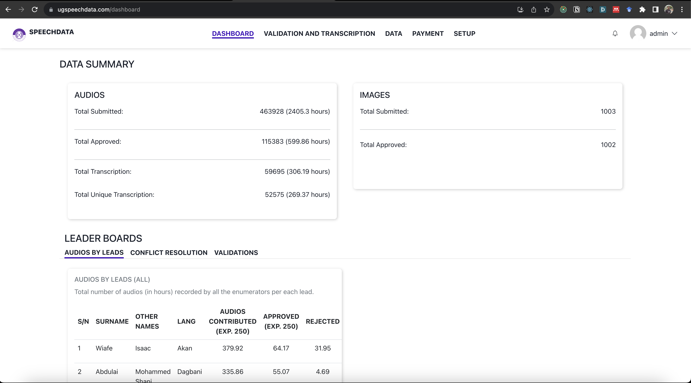

# UG SPECCH DATA - FRONTEND
Our software facilitates the collection of transcribed audio data and parallel text to create Neural Machine Translation (NMT) datasets for five Ghanaian languages: Akan, Ewe, Ikposo, Dagaare, and Dagbani. With a user-friendly interface and advanced alignment algorithms, it ensures dataset accuracy. The tool also employs data augmentation and scalable techniques to support low-resource environments. As part of a larger project, we aim to scale up data collection to 100 languages across Africa by 2023. This software empowers NMT model development, fostering communication across diverse African languages.

## Available Scripts

In the project directory, you can run:

### `npm start`!

Runs the app in the development mode.\
Open [http://localhost:3000](http://localhost:3000) to view it in your browser.

The page will reload when you make changes.\
You may also see any lint errors in the console.

### `npm run build`

Builds the app for production to the `build` folder.\
It correctly bundles React in production mode and optimizes the build for the best performance.

The build is minified and the filenames include the hashes.\
Your app is ready to be deployed!

See the section about [deployment](https://facebook.github.io/create-react-app/docs/deployment) for more information.

### Screenshots

### Live
[https://www.ugspeechdata.com/](https://www.ugspeechdata.com/)